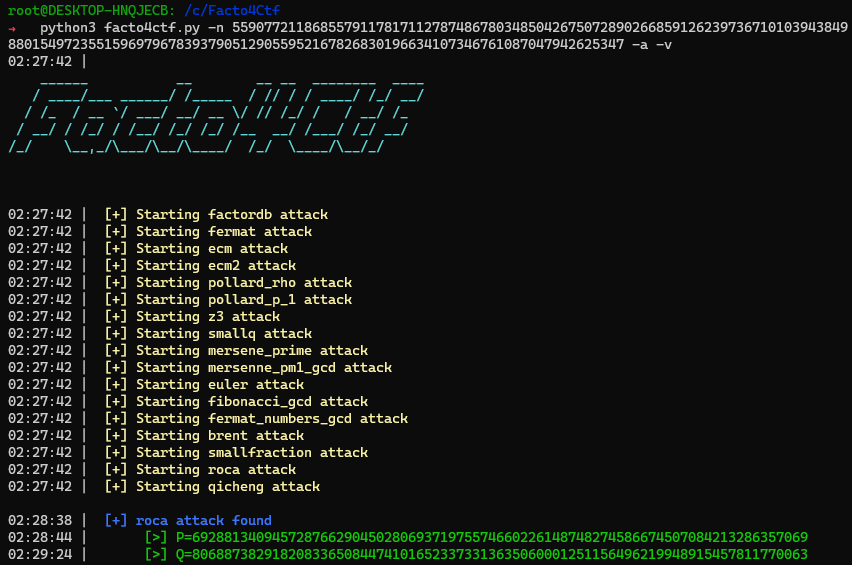

<p align="center">
  
</p>

#  Facto4CTF

# Description:

This tool is used to try out different factoring techniques (based on RsaCTFTool) . Mainly used in CTF.

## Commands :
```
usage: facto4ctf.py [-h] -n NUMBER [-a] [-m ALGORITHM] [-t TIMEOUT] [-v] [-q]

This tool is used to try out different factoring techniques. Mainly used in CTF.

optional arguments:
  -h, --help    show this help message and exit
  -n NUMBER     Number to factor
  -a            Try all algorithm
  -m ALGORITHM  Choose an algorithm : ['factordb', 'fermat', 'ecm', 'ecm2', 'pollard_rho',
                'pollard_p_1', 'z3', 'smallq', 'mersene_prime', 'mersenne_pm1_gcd', 'euler',
                'fibonacci_gcd', 'brent', 'smallfraction', 'roca', 'qicheng']
  -t TIMEOUT    Set Timeout (minutes) (default=5min)
  -v            Use verbose mode.
  -q            Use quiet mode.
```

## Usage:

```bash
python3 facto4ctf.py -n 5590772118685579117817112787486780348504267507289026685912623973671010394384988015497235515969796783937905129055952167826830196634107346761087047942625347 -a -v
```

## Installation :
```bash
git https://github.com/Vozec/Facto4CTF.git
cd Facto4CTF
python3 -m pip install -r requirements.txt
```

## Options :
- **-t** : Set Timeout
- **-a** : Test all algorithm
- **-q** : Don't displays the header

## Démo :


